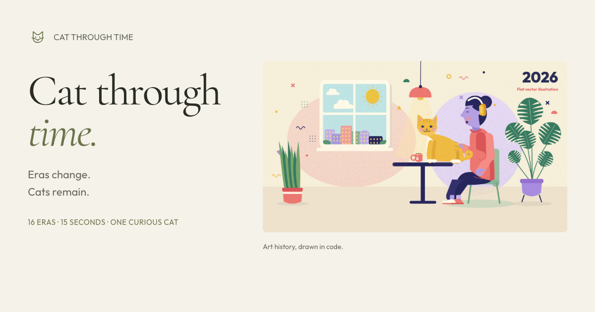

# Cat Through Time

[](https://github.com/Hostlife22/cat-through-time/actions/workflows/ci.yml)
[](LICENSE)

A 15-second journey through 16 art eras, drawn in code with React, Canvas and Remotion. One person, one cup and a curious cat.

[Open the animation](https://hostlife22.github.io/cat-through-time/)



Procedural textures, distinct historical costumes and lettering, independent character and environment animation, soft transitions, and an original synthesized soundtrack. The final film is **1920 × 1080 at 60 fps**. The cat jumps onto the table and knocks the cup to the floor.

[Contributing](CONTRIBUTING.md) · [Security](SECURITY.md) · [Accessibility](ACCESSIBILITY.md) · [Third-party licenses](docs/THIRD_PARTY_LICENSES.md)

## Run locally

Use Node.js 22.19 or newer (Node 22 is used in CI), npm, Python 3.12, NumPy, Pillow, and FFmpeg on your PATH. On macOS, the exporter uses installed Google Chrome. On other platforms, Remotion downloads its rendering browser.

```sh
npm ci
python3 -m pip install -r requirements.txt
npm run audio
npm run dev
```

Open the address printed by Vite. Playback starts paused. Use the player controls, choose an era, or select **Play again**. The **Download MP4** button becomes available after export.

To inspect the production bundle:

```sh
npm run build
npm run preview
```

The production base is `/cat-through-time/`, matching the repository's GitHub Pages URL. Open the preview address followed by `/cat-through-time/`. For another hosting path, update `vite.config.ts` and the canonical, Open Graph, Twitter, and structured-data URLs in `index.html`.

## Export

```sh
npm run render
```

The exporter synthesizes the soundtrack, renders the film, and checks every encoded frame for large single-frame flashes. It creates:

| Path                     | Output                             |
| ------------------------ | ---------------------------------- |
| `out/art-history.mp4`    | Finished H.264 film with AAC audio |
| `public/art-history.mp4` | Download copy served by the app    |
| `public/soundtrack.wav`  | Original synthesized soundtrack    |
| `out/storyboard.jpg`     | Sixteen labeled key frames         |
| `out/poster.jpg`         | Poster                             |
| `out/stills/`            | Era and action frames              |

Run `npm run build` after export to include the finished MP4 in the production bundle. Exports, screenshots, audio, and build output are generated locally and excluded from Git. The repository contains source code, configuration, scripts, and local font files with their licenses.

## Commands and CI

| Command                            | Purpose                                                         |
| ---------------------------------- | --------------------------------------------------------------- |
| `npm run dev`                      | Development server                                              |
| `npm run build` / `preview`        | Typechecked production build / local preview                    |
| `npm run format` / `format:check`  | Apply / check Prettier formatting                               |
| `npm run lint` / `lint:fix`        | ESLint, TypeScript and React Hooks checks / automatic fixes     |
| `npm run typecheck`                | Strict TypeScript checking                                      |
| `npm run check`                    | Formatting, lint, types, and production build                   |
| `npm run audio`                    | Synthesize the original soundtrack                              |
| `npm run render` / `render:stills` | Export film and stills / refresh stills only                    |
| `npm run check:preview`            | Browser checks without an exported MP4                          |
| `npm run check:production`         | Browser checks of the production bundle at `/cat-through-time/` |
| `npm run check:video`              | Browser checks plus finished-film verification                  |

CI runs on pushes to `main`, pull requests, and manual dispatch. The first job checks formatting, lint, types, and the build. The browser job installs Python dependencies and Chromium, synthesizes audio, and tests the animation directly from source. A full video render is not required in CI. Browser screenshots are retained as workflow artifacts for seven days.

GitHub Pages deploys only after a successful CI run triggered by a push to `main`. The deployment checks out the exact tested commit, renders and verifies the downloadable film, builds the site including local fonts and audio, and publishes `dist/`. Pull requests do not publish. Rendered assets stay in the deployment artifact and are excluded from Git.

On macOS, browser checks use installed Chrome. Elsewhere, install Chromium once with `npx playwright install chromium`.

The browser job also builds and checks the production bundle at `/cat-through-time/`, including fonts, audio, metadata assets, keyboard focus, and download availability before or after export.

The browser verifier covers 16 distinct styles, deterministic frame order, 90 transition frames, monotonic soft masks, animated dates, independent movement in ten scenery regions, local fonts, English interface text, arm geometry, continuous cat motion, replay, keyboard navigation, responsive layouts, reduced motion, metadata, and browser errors.

For a shorter rendering probe of the Renaissance, Ukiyo-e, Impressionism, and Post-Impressionism transitions:

```sh
node scripts/render.mjs --transition-probe
```

The probe is saved to `out/checks/transitions/probe.mp4`. Run `python3 scripts/check-export.py` to check an existing finished film independently.

## Change the animation

| File                                                            | Purpose                                                        |
| --------------------------------------------------------------- | -------------------------------------------------------------- |
| `src/timeline.json`                                             | Shared era timing, captions, transitions, and cat/cup events   |
| `src/art/render.ts`                                             | Frame composition, media treatment, reflections, and labels    |
| `src/art/transitions.ts`                                        | Soft procedural masks, easing, and interpolated dates          |
| `src/art/materials.ts`                                          | Paper, stone, cloth, crackle, ornaments, and painted textures  |
| `src/art/figures.ts`, `portraits.ts`, `styledCats.ts`           | Historical poses, costumes, faces, and cats                    |
| `src/art/classicRoom.ts`, `impastoRoom.ts`, `decoratedRooms.ts` | Renaissance, painted, Gothic, Ukiyo-e, and Art Nouveau rooms   |
| `src/art/painted.ts`, `retro3d.ts`, `modern.ts`                 | Painted figures, early CGI lighting, and the final action      |
| `src/art/environment.ts`, `scenery.ts`                          | Independent room details, light, waves, plants, and atmosphere |
| `src/art/lettering.ts`, `src/typography.ts`                     | Era-specific typefaces and local font loading                  |
| `scripts/soundtrack.py`                                         | Music and synchronized sound effects                           |

Each frame is determined by its frame number. Textures use seeded randomness, static details are cached, and moving shapes are redrawn for every frame. Both scenes keep moving during a transition. The exporter disables GPU rasterization in installed macOS Chrome to avoid duplicated canvas tiles in screenshots.

Keep image-independent geometry, one shared timeline, and deterministic rendering when adding a style. Re-export after changing the timeline so picture and sound remain synchronized.

## Credits and license

Project code and documentation: **MIT © 2026 hostlife22**. See [LICENSE](LICENSE). Fonts and dependencies retain their own licenses; Remotion has separate licensing terms. See [Third-party licenses](docs/THIRD_PARTY_LICENSES.md).

The visual idea and sequence of eras were inspired by the user-provided [Tak reference](https://x.com/cherry_mx_reds/status/2106095190285144331). This is an independent implementation; the author's source code was not used. Reference video/audio and generated illustrations are not included. All rooms, characters, textures, and animation are drawn in Canvas; music and effects are synthesized locally.
